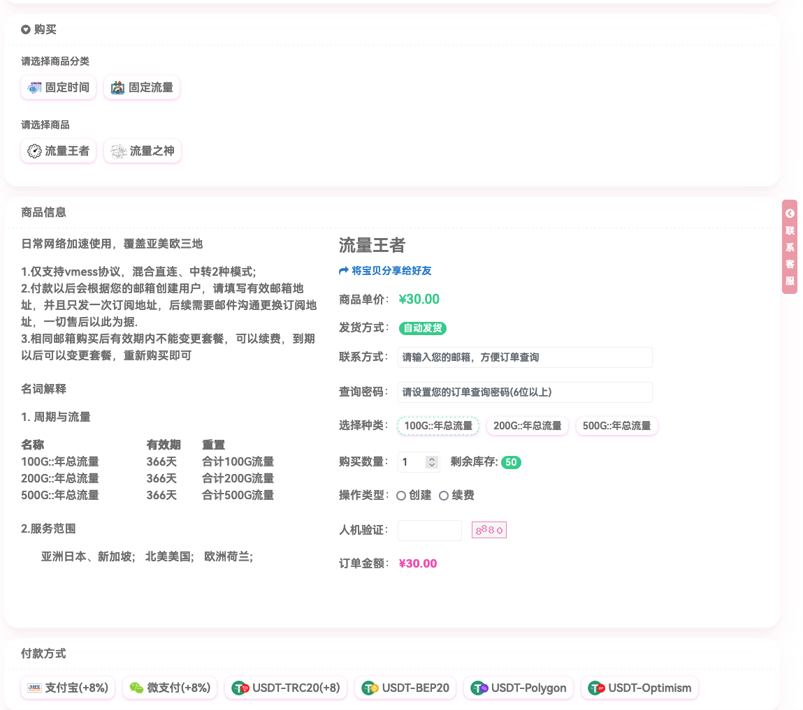
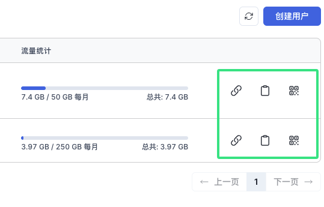

# 科学上网 让我们更好的工作和生活

<!-- TOC -->
* [科学上网 让我们更好的工作和生活](#科学上网-让我们更好的工作和生活)
    * [科学上网的目的](#科学上网的目的)
    * [目前主流的技术](#目前主流的技术)
    * [免费/收费订阅地址](#免费收费订阅地址)
    * [相关的下载](#相关的下载)
    * [代理服务器技术](#代理服务器技术)
    * [开始使用](#开始使用)
<!-- TOC -->

### 科学上网的目的
- 绕过服务器的限制;
- 访问被屏蔽的网站;
- 加快访问速度.

### 目前主流的技术
- VPN，这种是最专业的网络优化方案，常见的有OpenVPN;
- 代理，通过中转服务器获取数据后，返还给用户，常见的有Xray.

### 免费/收费订阅地址
如果你仅仅想找到可用的订阅， 那么可以访问: https://t.me/ovsealinker

这个群会提供免费的订阅，也有付费的订阅，付费订阅只是速度比较快一些，高峰期可用性更好些

下面是最便宜的代理服务器，购买地址: https://s.ovsea.link

### 相关的下载
在项目目录的software里面有文章中说到的软件， 有任何的技术问题也可加入上面的群进行交流

### 代理服务器技术
- Xray-Core 技术

   强烈推荐的服务器端软件
  https://github.com/XTLS/Xray-core
  该软件是一种代理服务软件，通过规则组合可以支持多种协议的通信，通过在传输中的加密，保证数据的安全性

  这里描述下分别在Ubuntu和ArchLinux上的安装，先下载对应的系统软件到您的服务器上
  
Ubuntu推荐使用官方的脚本安装

   安装

      bash -c "$(curl -L https://github.com/XTLS/Xray-install/raw/main/install-release.sh)" @ install

  更新地理信息
    
      bash -c "$(curl -L https://github.com/XTLS/Xray-install/raw/main/install-release.sh)" @ install-geodata

  
Archlinux, 请注意x86_64、Arm版本的区别
   Arm
  
        pacman -U xray-1.8.24-1-aarch64.pkg.tar.xz
  
  x86_64

        pacman -U xray-1.8.24-1-x86_64.pkg.tar.zst    

- Marzban 管理控制台

     强烈推荐使用该面板，因为配置方便，协议齐全，运行稳定

    1.安装运行环境
    
    Ubuntu

        apt update && apt-get upgrade && apt-get install gcc python3-pip python3-virtualenvwrapper

    ArchLinux

        pacman -S gcc
        pacman -U python311-3.11.9-2-x86_64.pkg.tar.zst

    2.创建虚拟环境

    Ubuntu

        cd /srv
        source /usr/share/virtualenvwrapper/virtualenvwrapper.sh
        /usr/bin/python3 -m venv /srv/marzban_env
        /srv/marzban_env/bin/pip install --upgrade pip

    ArchLinux

        cd /srv
        set VIRTUALENVWRAPPER_PYTHON=/usr/bin/python
        /usr/bin/virtualenvwrapper.sh marzban_env
        /usr/bin/python -m venv /srv/marzban_env
        /srv/marzban_env/bin/pip install --upgrade pip
  
    3.下载对应的软件包，安装依赖

        git clone https://github.com/Gozargah/Marzban.git
        cd Marzban
        /srv/marzban_env/bin/pip3 install -r requirements.txt
  
    4.修改配置文件
        
        cp .env.example .env
        nano -w .env
  
        SUDO_USERNAME = "admin"
        SUDO_PASSWORD = "password"
  
    5.初始化数据
  
        cd Marzban
        /srv/marzban_env/bin/alembic upgrade head
  
    6.写个服务让她自动启动吧
  
        nano -w /usr/lib/systemd/system/marzban.service

        [Unit]
        Description=Marzban Service
        Documentation=https://github.com/gozargah/marzban
        After=network.target nss-lookup.target
        
        [Service]
        ExecStart=/srv/marzban_env/bin/python3 /srv/Marzban/main.py
        Restart=on-failure
        WorkingDirectory=/srv/Marzban
        
        [Install]
        WantedBy=multi-user.target

    6.自动启动

        systemctl enable marzban.service
        systemctl start marzban

    7.创建管理员，如果配置文件里面SUDO配置了就不需要了
  
        /srv/marzban_env/bin/python3 marzban-cli.py admin create --sudo

### 开始使用

- 打开控制台: http://ip:8000/dashboard/, 使用上面的密码登录即可

    

- 在后台创建用户，输入您的用户名即可

    

- 获取用户链接

    

- 导入到小火箭使用

    
